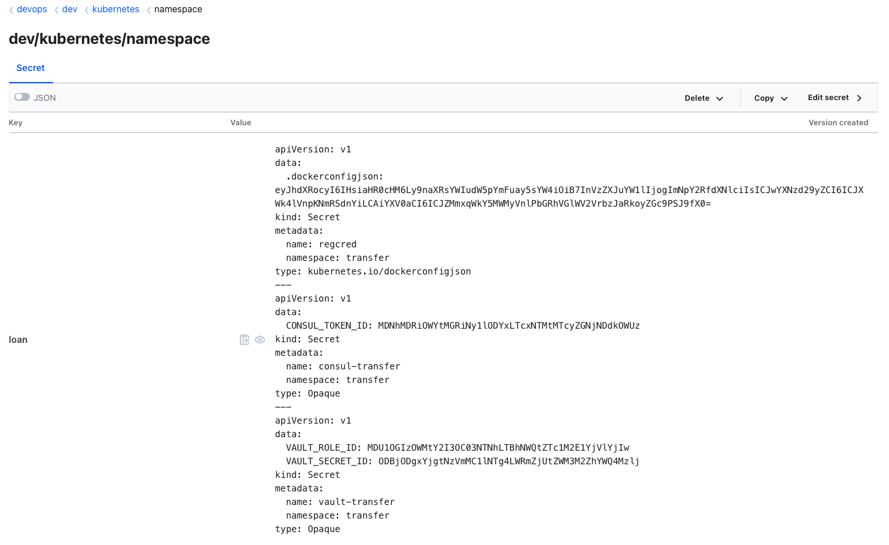
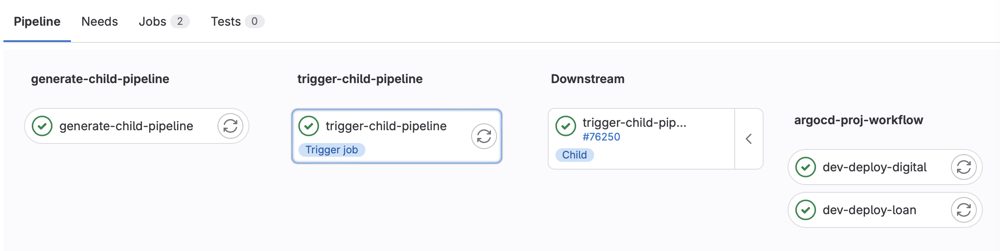
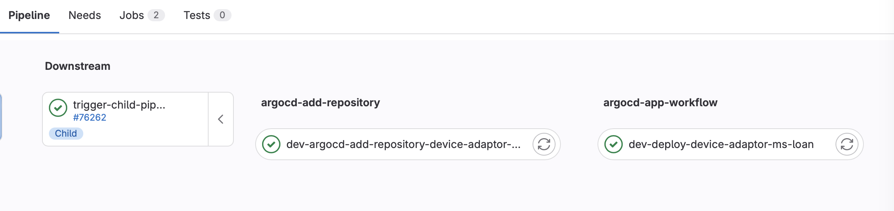
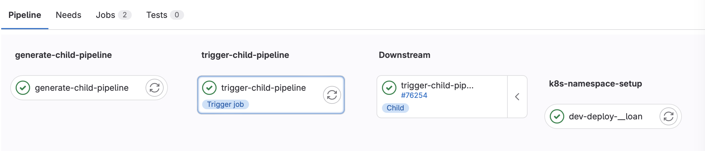

# Centralized Configuration Management via Git-based Dynamic Pipelines

## Overview

This documentation details an advanced DevOps solution tailored for streamlined continuous integration and deployment (CI/CD) within Kubernetes environments. By leveraging GitLab CI/CD for pipeline automation and ArgoCD for application deployment, this solution offers a comprehensive approach to managing Kubernetes namespaces based configurations, ArgoCD applications, and projects. A cornerstone of this strategy is the dynamic generation of CI/CD pipelines based on repository changes, ensuring automation, security, and efficiency across multiple deployment environments. The intent is to guarantee that every aspect of the deployment to Kubernetes clusters is version-controlled and managed through automated pipelines, fostering a highly auditable, transparent, and efficient deployment process.

## Components

### Manifests Directory

At the heart of this solution, the manifests directory contains all necessary Kubernetes and ArgoCD manifest files, neatly organized into specific workflows for efficient management:

- **ArgoCD Application Workflow (`argocd_app_workflow`)**: Holds Application YAML files for defining ArgoCD deployments.
- **ArgoCD Project Workflow (`argocd_proj_workflow`)**: Contains project-level configuration files for ArgoCD.
- **Kubernetes Namespace Setup (`k8s_namespace_setup`)**: Comprises YAML files for establishing Kubernetes namespaces, including network policies and security contexts.

### Integrated Secret Management with Vault

This solution integrates Vault to securely manage namespace-based secrets, such as:

- **Registry Credentials (`regcred`)**: Ensures secure access to container registries.
- **Vault RoleID and SecretID**: Authenticates applications and services with Vault.
- **Consul Token**: Secures access to Consul-based services.

This seamless integration with Vault ensures that all sensitive information is securely managed and applied, enhancing the security and efficiency of the deployment process across environments.

### Scripts

- **`main.py`**: Utilizes GitPython to detect changes in the last commit, dynamically generating `child-pipeline-gitlab-ci.yml` to reflect these changes.
- **`template.py`**: Contains the PipelineWriter template classes for constructing segments of the `.gitlab-ci.yml` file, including jobs for deploying namespaces, ArgoCD projects, and applications.

### GitLab CI/CD Pipeline Configuration

The `.gitlab-ci.yml` outlines the CI/CD pipeline stages:

1. **Generate Child Pipeline**: Prepares `child-pipeline-gitlab-ci.yml` by python based scripts and installing dependencies.
2. **Trigger Child Pipeline**: Executes the dynamically generated child pipeline, applying deployments as defined.

## Custom Pipeline Images

Additionally, all pipeline jobs in this comprehensive DevOps solution utilize custom images. These custom images include Vault for secrets management, Python for scripting and automation, and ArgoCD for application deployment. The use of these tailored images enhances the efficiency, security, and versatility of the CI/CD pipeline, further solidifying its effectiveness in managing deployments across various environments.

## Workflow

The workflow emphasizes change detection, dynamic pipeline generation, and pipeline execution, ensuring that modifications are efficiently reflected in Kubernetes and ArgoCD configurations through an automated process.

## Tailored Branch Strategy for Each Cluster

Our strategy leverages individual branches for each Kubernetes cluster, ensuring dedicated and precise deployments. This approach facilitates environment-specific configurations and deployments, dynamically generating and fine-tuning CI/CD pipelines to align with the specific requirements of each branch and its corresponding cluster. This method enhances our ability to manage complex deployments seamlessly across multiple clusters, embodying our commitment to efficient and scalable DevOps practices.

## Usage

Guidance is provided for modifying namespace and ArgoCD configurations, alongside adapting the pipeline for optimal resource usage and deployment times.

## Benefits

The solution automates environment configuration, dynamically generates pipelines tailored to code changes, and streamlines the deployment workflow, offering a robust framework for managing deployments across multiple environments. This approach not only enhances automation, security, and efficiency but also aligns with best practices for agile and responsive development workflows.

## Conclusion

By ensuring all deployments to Kubernetes clusters are version-controlled and managed via automated pipelines, this DevOps solution significantly contributes to a secure, efficient, and transparent deployment ecosystem.

## Workflow Visualizations

To provide a visual understanding of the pipeline processes, the following diagrams illustrate the key components of the solution.

## Secrets Management

Here is an example of how secrets are managed and stored securely:

### ArgoCD Project Workflow

This diagram represents the workflow for managing ArgoCD project configurations.

### ArgoCD Application Workflow

This workflow diagram depicts the process of defining and deploying ArgoCD applications.

### Kubernetes Namespace-based Setup

Here, the setup for Kubernetes namespaces is outlined, including network policies and security contexts.

__Author Information__
------------------

Samir Nabadov
